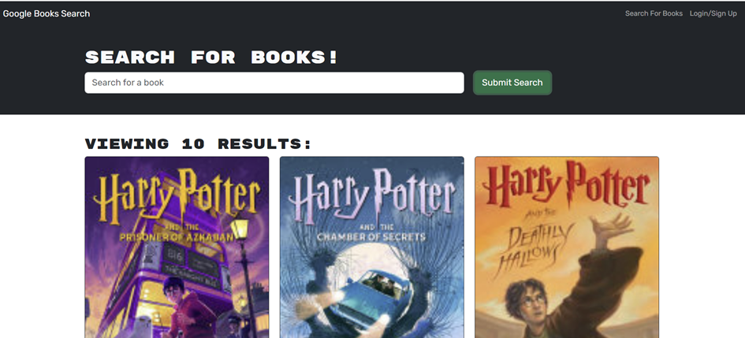

# REZTECH Book Search Engine

## Summary
In this challenge, we'll build a fullstack MERN application that allows a user to search for book titles, view the search results and save any book presented in the search result to their profile.  The application is powered by the Google Book Search API that is used for performing the search, GraphQL backend that provides the relevant and functioning queries and mutations to the frontend and MongoDB along with Mongoose ODM for modeling and implementing the User and Book database document models. 

## Architecture
The application uses the conventional structure for a fullstack MERN application that is supported by React on the frontend and GraphQL on the backend.  

The server.js implements the Apollo Server and applies it to the Express Server to function as the middleware.

The auth.js on the Server and Client side perform the authentication services for signing a JWT token, saving and retrieving the token from local storage, checking the token's validity, and managing the user's login and logout activities.

The database models include the Book.js and User.js that define the document structure for capturing the relevant attributes of a User and a Book object.

The Schema on the backend is comprised of typeDefs.js that follows the model structure for User and Book documents to define the object types and relevant queries and mutations that are in turn implemented by the resolvers.js.

The relevant queries and mutations include me, which returns the current logged-in user, and a collection of mutations (addUser, login, saveBook, removeBook) for adding a new user and returning a JWT token, logging in a user, saving a book to a user’s savedBooks array, and removing a book from a user’s savedBooks array.

The frontend features the conventional queries.js and mutations.js proxy files that map to the corresponding reslovers in the backend and are used to invoke the respective functions in the implementation of React components and/or pages.

Specifically, the fronted features three components (Navbar.jsx, LoginForm.jsx, SignupForm.jsx) for providing the navigational functions of the application, including (Search for Books) and (Login/Signup) and the user Login/Signup forms that are used for the obvious and intended purposes.

The frontend also features two pages (SearchBooks.jsx) and (SavedBooks.jsx) that are used to search for books as well as to retrieve and manage a logged in user's saved books, respectively.

## Operation
### User Not Logged In
The application's landing page features a navigational bar that provides three functional elements:

1. SEARCH FOR BOOKS input field
This input field supports the primary function of this application and is used by the user to search for any book that they may be interested in.  To search for a particular book, the user enters the title of a book in the search field and clicks the (Submit Search) button. This invokes the search function and the results of the search, which may include all matches found, are displayed in the body of the page under the search field, including the books' images, titles and descriptions. Right above the search result an indicator displays "Viewing n Results", where n is the total number of the books in the search result.

2. Search for Books link
This link returns the user to the landing page and has meaningful context if the user has signed up or is logged in.  See more about the logged in user below.

3. Login/Signup link
This link displays a dialog that allows the user to either sign up or log in via the provided and corresponding buttons.  The Sign up button displays a form for catpturing the user's (username, email and password), whereas the Login button displays a form for capturing the necessary login credentials, which includes (email and password).

### User is Logged In
Once the user signs up or logs in, in addition to displaying the (Search for Books) link, the Login/Signup link is replaced with a "Logout" link and the application exposes additional features that can only be used by a logged in user.  The following outlines the additional features:

1. Save this Book! button 
Once a book search is conducted and the page is populated with a collection of books matching the search term, a button named "Save this Book!" is displayed under the description of each book in the search result.  Once this button is clicked, the button text changes to "This book has been saved" and the corresponding book is saved to user's profile.

2. See Your Books link
Once a user is logged in, this additional link is displayed to the left of the (Logout) link on the navigation bar. If the logged in user clicks on this link, the application navigates to a new page with the header title "VIEWING SAVED BOOKS!" where the list of previously saved books are displayed in the same manner as that of the landing page, but with the following differences:
* Right above the list of saved books, there is an indicator that displays "VIEWING n BOOK(s)", where n is the total number of the saved and displayed books.
* The "Save this Book!" button that was ordinarily displayed in the "Search for Books" page is now replaced with a "Delete this Book!" button

Pressing the "Delete this Book!" button deletes the corresponding book and the deleted book is no longer displayed on the page.

While on this page, if the user clicks on the (Logout) link, the user is logged out and the application navigates back to the "Search for Books" page.  Once on the "Search for Books!" page, the Logout link is replaced with the original Login/Signup link.

If the user clicks on the "Search for Books" link instead, the application navigates to the "Search for Books!" page as well but the user continues to be logged in.  

The logged in user is able to continue to search for books and save them to their profile, view their saved books and delete their saved books until they click on the Logout link and log out of their profile.

## Future Enhancements
This application in its current form serves as a proof of concept for implementing a fullstack MERN application and its objectives are purely academic.

Additional features are undoubtedly needed to make this application more useful.  The following is an outline of upcoming features that are currently in the planning phase:

1. User Profile
The ability to display and edit the user profile such as email and password should be considered given that users may need to change their login credentials from time to time

2. Ranking the Saved Books
The ability to rank the user's saved books, such as a five star ranking system, should be considered so as to help the user in prioritizing the purchase plans for the selected books

3. Contact Page
A link and a dedicated page for contacting the author of the application should be considered given that users may want to get in touch with the author to share their thoughts or report a problem that they have encountered with using the application

## Deployment
The application is deployed to the cloud based Render platform featuring continuous development and deployment of the hosted applications.  

## Running the Live Application
To run the application on the Render platform, click the following link: https://reztech-book-search-1.onrender.com/

## Executing the Application Locally
To run the application locally, perform the following
* Clone the project from: https://github.com/reztndev/REZTECH-Book-Search
* Open the project in Visual Studio Code
* Open a terminal and run the following:
1. npm install
2. npm run develop

## Screenshots of the Application:

